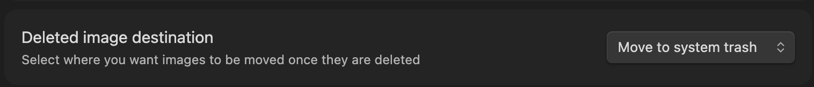
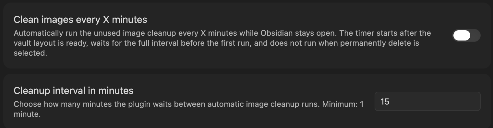
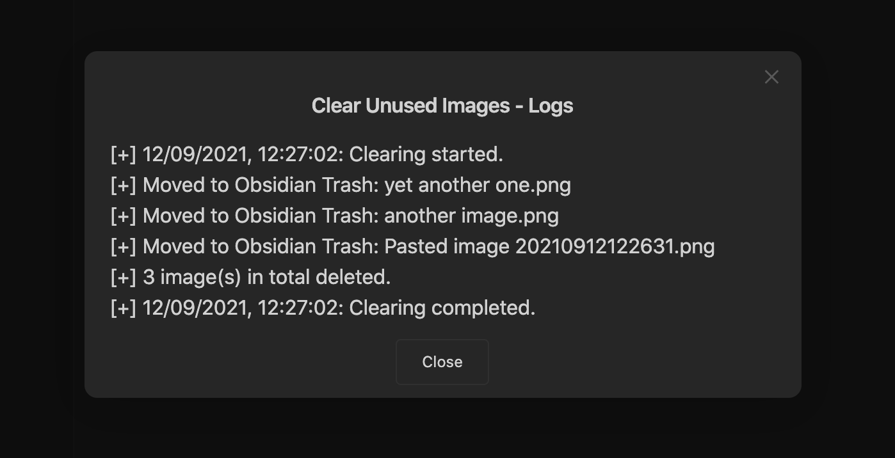
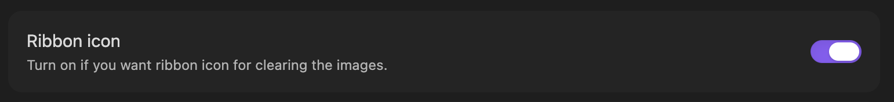
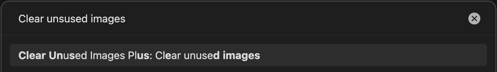
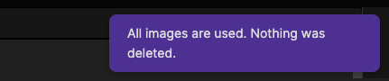
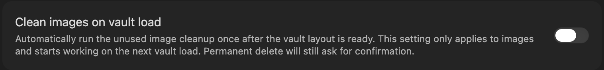
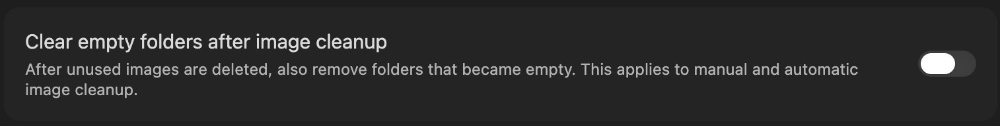
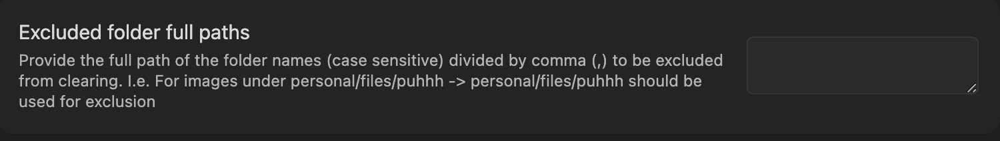
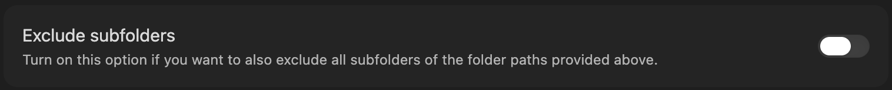

# Clear Unused Images Plus

[](./LICENSE)
[](./manifest.json)
[](https://obsidian.md/)
[](https://www.typescriptlang.org/)
[](https://vitest.dev/)

Clear Unused Images Plus is an Obsidian plugin for finding and deleting images that are no longer referenced in your vault. It scans markdown notes, supported frontmatter references, canvas files, and attachment links, then compares those references against image files in the vault.

This project is a maintained fork of [`oz-clear-unused-images`](https://github.com/ozntel/oz-clear-unused-images-obsidian). The current fork is maintained by [Aleksei B](https://github.com/Puhhh). The original plugin author is [Ozan](https://www.ozan.pl).

See [CHANGELOG.md](./CHANGELOG.md) for release history.

## Screenshots







## Features

- Finds unused images in Obsidian vaults
- Supports markdown links, wikilinks, canvas-linked files, and supported frontmatter image references
- Deletes files through Obsidian Trash, System Trash, or Permanent Delete
- Optional review and log modal for cleanup results
- Optional cleanup once after vault load
- Optional recurring cleanup every configured number of minutes
- Optional empty-folder cleanup after deleted images leave folders empty
- Excluded folder paths with optional subfolder matching
- Separate commands for unused images, broader unused attachments, and empty folders

## Installation

1. Open Obsidian Settings.
2. Go to Community plugins.
3. Install `Clear Unused Images Plus`.
4. Activate the plugin from Community Plugins.
5. Configure the delete destination before running cleanup.

## Usage

Select the destination for deleted images under the `Clear Unused Images Plus Settings` tab:


- **Move to Obsidian Trash** moves files to `.trash` inside the Obsidian vault.
- **Move to System Trash** moves files to the operating system trash.
- **Permanently Delete** destroys files permanently and cannot be undone.

The plugin provides three cleanup commands:

- `Clear unused images` checks only image files. It is limited to jpg, jpeg, png, gif, svg, bmp, and webp.
- `Clear unused attachments` checks all non-note attachments in the vault, not just images. This can include PDFs, audio, video, archives, and other non-markdown files.
- `Clear unused folders` removes empty folders recursively, starting with the deepest folders first. It uses the selected delete destination and keeps folders under excluded folder paths.

Use `Clear unused images` for routine image cleanup. Use `Clear unused attachments` more carefully because it has a wider scope and can delete any attachment the plugin cannot find referenced in notes, canvas files, or supported frontmatter references. Use `Clear unused folders` after file cleanup if you want to remove empty folder structure left behind, or enable `Clear empty folders after image cleanup` to do that automatically.

You can run cleanup from the ribbon icon or from the Command Palette with `Ctrl/Cmd + P`.





If `Delete Logs` is enabled, the plugin shows a modal with information about deleted files:


If all images are still used, the plugin reports that nothing was deleted:



### Automatic Cleanup

Enable `Clean Images On Vault Load` to run image cleanup once after the vault layout is ready:



- The startup cleanup only runs the image cleanup flow, not `Clear unused attachments`.
- If you enable the setting while Obsidian is already open, the change takes effect on the next vault load.
- If `Permanently Delete` is selected, the confirmation dialog still appears before deletion starts.

Enable `Clean Images Every X Minutes` to run recurring image cleanup while Obsidian stays open:


- The first periodic cleanup waits the full configured interval.
- If both automatic modes are enabled, the vault-load cleanup runs once and periodic cleanup starts later on its normal interval.
- Periodic cleanup is disabled while `Permanently Delete` is selected.
- Changing the toggle, interval, or delete destination updates the scheduler for the current session.

Enable `Clear empty folders after image cleanup` to remove folders that become empty after unused image cleanup deletes images:



- This setting applies to `Clear unused images`, `Clean Images On Vault Load`, and `Clean Images Every X Minutes`.
- It does not change `Clear unused attachments`.
- It only removes folders that directly contained images deleted by that cleanup run.
- If `Permanently Delete` is selected, folder deletion asks for a separate confirmation after image deletion confirmation.

### Excluded Folders

Use excluded folders to prevent cleanup from deleting files under specific vault paths. Separate multiple folders with commas and provide full paths inside the vault.



You can also exclude every subfolder under those paths:



## Development

```bash
npm install
npm run dev
npm test
npm run build
```

- `npm run dev` builds in watch mode.
- `npm test` runs the Vitest suite.
- `npm run build` creates the production `main.js` bundle.
- After `npm run build`, refresh the installed vault copy before manual testing:

```bash
cp main.js .obsidian/plugins/clear-unused-images-plus/main.js
cp styles.css .obsidian/plugins/clear-unused-images-plus/styles.css
```

- To verify the installed copy is current, compare the files directly:

```bash
git diff --no-index -- main.js .obsidian/plugins/clear-unused-images-plus/main.js
git diff --no-index -- styles.css .obsidian/plugins/clear-unused-images-plus/styles.css
```

No output means the local Obsidian plugin copy is in sync.

## Release

GitHub Releases are published by GitHub Actions when a version tag is pushed.

1. Update `package.json`, `package-lock.json`, `manifest.json`, `versions.json`, and `CHANGELOG.md`.
2. Run `npm run lint`, `npm test`, and `npm run build`.
3. Copy `main.js` and `styles.css` into `.obsidian/plugins/clear-unused-images-plus/` for manual Obsidian verification.
4. Commit the release changes, open a pull request into `main`, and merge it.
5. Create and push a version tag from `main`:

```bash
git tag X.Y.Z
git push origin main
git push origin X.Y.Z
```

The release workflow verifies that the tag version matches `package.json`, `manifest.json`, and `versions.json`, rebuilds `main.js`, creates GitHub artifact attestations, and uploads `manifest.json`, `main.js`, and `styles.css` as release assets. Obsidian requires the GitHub release tag to match `manifest.json` exactly, so use `1.0.0`, not `v1.0.0`.

## Project Structure

- `src/main.ts` - Obsidian plugin entry point
- `src/util.ts` - vault scanning and cleanup orchestration
- `src/linkDetector.ts` - markdown and wikilink reference detection
- `src/referenceUtils.ts` - pure reference and path helpers
- `src/folderCleanup.ts` - empty-folder cleanup behavior
- `tests/` - regression coverage for cleanup, references, settings, and scheduling
- `docs/assets/` - screenshot assets used in this README
- `styles.css` - plugin styles
- `main.js` - built plugin bundle

## Testing

Tests use `vitest`, with `jsdom` available through per-file `@vitest-environment jsdom` comments when DOM coverage is needed. The most important coverage is around markdown links, wikilinks, frontmatter references, canvas parsing, excluded folders, delete failure handling, and startup or periodic cleanup scheduling. Run `npm run lint` and `npm test` before publishing changes.

When fixing safety bugs, add a focused regression first, verify it fails, then fix the implementation. For deletion or exclusion bugs, cover both helper behavior and cleanup-flow results.

## Notes

- The plugin targets Obsidian vault cleanup and does not require a separate backend.
- `main.js` is generated; do not edit it by hand.
- The local development copy in `.obsidian/plugins/clear-unused-images-plus/` is for testing only and is not part of the Git repository.
- Manual Obsidian checks should include markdown links, wikilinks, frontmatter image references, canvas-linked files, excluded folders, Obsidian Trash, System Trash, and Permanent Delete.
